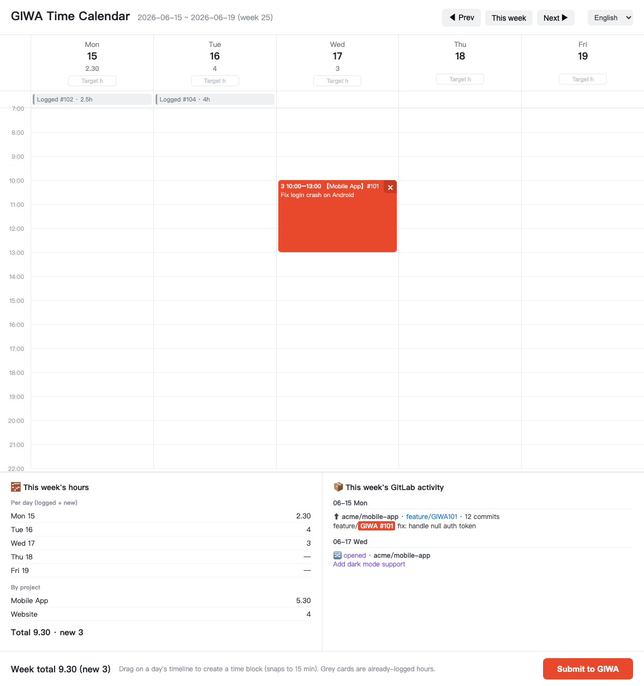

# GIWA — Redmine Ticket / Time-Tracking Tool

Query, analyze, and operate on the tickets, time entries, and project data of a Redmine project management platform (codenamed **GIWA** here) through the **Redmine REST API**.
The headline feature is **logging time by dragging blocks on a web calendar**, which solves the pain of manually filling in time entries task by task every week.

It has two parts:
1. **The `./giwa` CLI tool** — one-command queries for common info (zero dependencies, Python 3 standard library only)
2. **A natural-language workflow** — just ask Claude (or any assistant that can call APIs) to do the work for you in plain language

> This is a personal tool built for a specific Redmine instance. Just put your own Redmine URL and API key into `.env` and it works with any Redmine site.

---

## Prerequisites

- **Python 3** (standard library only, no `pip install` needed)
- A **Redmine** site + your account's **API key**
- Optional: a browser (for logging time via the `timesheet` web page), VS Code (`mine` will open the exported file with it automatically)

## Install & Configure

```bash
git clone git@github.com:junjielyu13/giwa-impute-hours.git
cd giwa-impute-hours
cp .env.example .env          # then edit .env and fill in your config
chmod +x giwa giwa.py         # make sure they're executable
```

`.env` contents:

```
GIWA_URL=https://your-redmine-host
GIWA_KEY=your_api_key
```

Get the API key from Redmine → **My account** → **API access key** → **Show**.

> ⚠️ `.env` is already in `.gitignore` and won't be committed. An API key carries the same privileges as your account, so never leak it or write it into any file that goes into git.

---

## 1. CLI Tool

```bash
./giwa overview              # global ticket overview
./giwa mine                  # your open tickets → export to MINE.md (with clickable links)
./giwa timesheet             # open a local web page (calendar week view), drag blocks to log time and submit
./giwa --help                # show help
```

### overview output
- Total ticket count + open / closed stats
- Distribution by project
- Distribution by status
- Top 15 by assignee

### mine output
Generates `MINE.md`: split into two groups, "🔧 To do" and "✅ Resolved, pending closure", grouped by project,
where each ticket number is a Markdown link (e.g. `[#1234](https://your-redmine-host/issues/1234)`).
Open it in an editor that supports Markdown preview and click through to the corresponding ticket.

### timesheet — log time (solves the Monday pain of logging time task by task)
`./giwa timesheet` starts a local web page (**calendar week view**) and opens your browser automatically (implementation in `timesheet_web.py`):



> The screenshot above is generated by the Playwright test (`tests/test_timesheet.py`) against mock data — see [Testing](#testing).

- Columns = Monday–Friday, vertical axis = time (7:00–22:00). Use ◀/▶ to switch to the previous/next week.
- **Press and drag on a day's timeline** = create a time block (snaps to 15-minute increments); on release, pick a task and fill in an optional comment.
- The block's **duration** is converted into logged hours. GIWA only stores "date + number of hours", not the time of day, so the timeline is only used for an intuitive layout.
- The gray card at the top of each column = time **already logged** in GIWA (read automatically, not editable, **never resubmitted**).
- The bottom shows daily / weekly totals. Click **Submit to GIWA** → browser confirms again → writes; successful blocks turn into gray "already logged" cards.
- Activity defaults to **Others**; an empty comment automatically uses "type #number: subject".
- **Daily target hours** (optional): each column header lets you fill in the day's expected working time (e.g. `8:30`), and the total is shown as
  "logged / target" with a background color reflecting whether the target is met (met = green, under = orange, over = red) — a reminder only, not enforced.
  Supports `8:30` / `8.30` / `830` formats. Targets are stored per **specific date** in the browser's local storage, **independent for each week and not shared**.
- **Closing the tab automatically stops the server**: the page sends a heartbeat every 3 seconds and notifies the server to exit when closed;
  even if the browser crashes, a server-side 8-second heartbeat timeout will stop it as a fallback. You can also press Ctrl+C in the terminal.
- **Task selection list**: grouped by project via `<optgroup>`, with options tagged by type `[Task]/[Epic]/[Incidencia]/...`;
  at the top are two shortcut groups, **🦊 gitlab** (GIWA tasks linked to this week's PRs/branches) and **🕒 This week** (issues you worked on during the selected week, including closed).
  Not listed? Pick **✏️ Enter a GIWA ID manually…** to type the ticket number directly (it's validated before being added).
- **This week's GitLab activity** (floating panel in the bottom-right corner, requires `GITLAB_URL`/`GITLAB_TOKEN`, read-only):
  lists by day which branch was pushed to which repo (commit count) and which MRs were opened/merged; the repo, branch, and MR are clickable links into GitLab, and a `GIWA<number>` in a branch name auto-links to the ticket.
- The default port is 8765; if it's in use, run `./giwa timesheet --port 8790`.

> 🌐 The web page is multi-language: it **auto-detects your browser language** and defaults to English, with a language switcher button for **EN / 中文 / ES / CA** (English, Chinese, Spanish, Catalan).

### Extending
`giwa.py` uses a subcommand structure; add a new command simply by adding a function to the `COMMANDS` dict
(planned: `mine`, `show #ID`, `project NAME`, `due`, `urgent`).

---

## 2. Natural-Language Workflow

When you don't feel like typing commands, just tell Claude what you want in plain language and it'll call the Redmine API to get it done. For example:

| You say | Claude does |
|---|---|
| "What's the status of #1234, who commented?" | Pulls the details + comment history and summarizes |
| "How many tickets are left unfinished in project X?" | Filters open tickets and lists them |
| "How many hours did I log this week?" | Queries time entries and totals them |
| "Which of mine are due soon?" | Filters sorted by due date |
| "Set #1234 to In Progress" | Updates the ticket (**write operation, confirm first**) |
| "Create 5 tickets for me: …" | Bulk-creates (**write operation, confirm first**) |

### Read / Write rules
- 📖 **Read operations** (query, stats, export, analysis) → done directly
- ✍️ **Write operations** (change status, add comments, create/delete tickets, edit time entries) → Claude will first explain "what it's about to change" and only execute **after you confirm**

---

## Testing

The web UI has a [Playwright](https://playwright.dev/python/) test that **mocks every `/api/*` response** (no Redmine server or API key needed), so it runs deterministically and leaks no real data. It also regenerates the screenshot above.

```bash
python3 -m venv .venv && source .venv/bin/activate
pip install playwright && playwright install chromium
python tests/test_timesheet.py        # asserts UI behaviour + writes docs/timesheet.png
```

It checks: the calendar renders (5 day columns + already-logged chips), drag-to-create a block opens the task popup, the **manual GIWA-ID** option is present, the **GitLab links** (repo / branch / MR) are clickable, and the **language switcher** (EN/中文/ES/CA) updates the UI. Playwright is a **dev-only** dependency — the tool itself stays zero-dependency.

---

## What the Redmine API Can Do (quick reference)

- **Issues**: full CRUD, rich filtering (status / project / assignee / time / custom fields), `include` comment history, attachments, relations, sub-issues
- **Time Entries**: full CRUD
- **Projects / Versions / Categories / Wiki / Memberships / Groups**: full CRUD (some require admin privileges)
- **Attachments**: upload / download / delete
- **Search** (full-text), **News**, **Issue Relations**
- **Enumerations** (statuses, trackers, priorities, roles): read-only
- **Plugins** (Agile, Checklists, etc.): each has its own separate API, to be verified individually

> What you can actually do depends on your account's privileges. A regular account usually has permission for everyday ticket / time-entry / comment operations, while admin-level operations (creating projects, managing users) will mostly be denied.

See [`AGENTS.md`](./AGENTS.md) for detailed working conventions and extension notes (read by AI coding agents; `CLAUDE.md` is a symlink to it for Claude Code).
